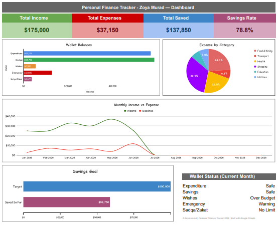
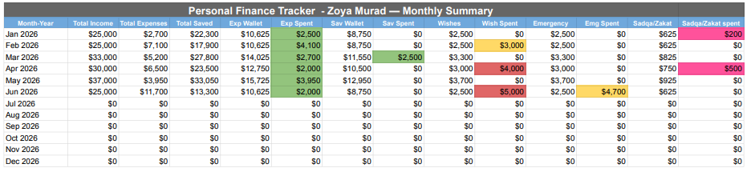
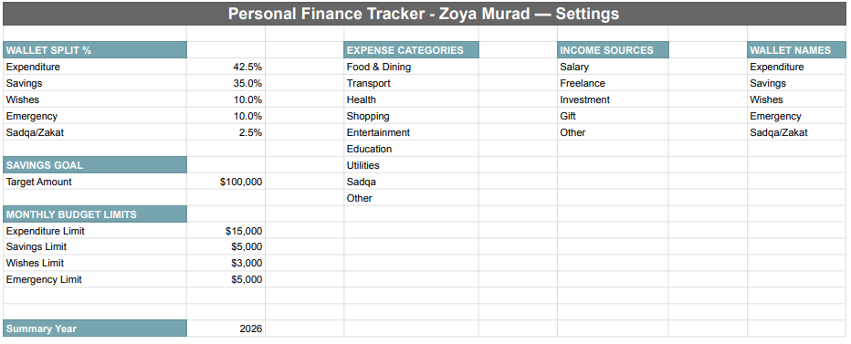
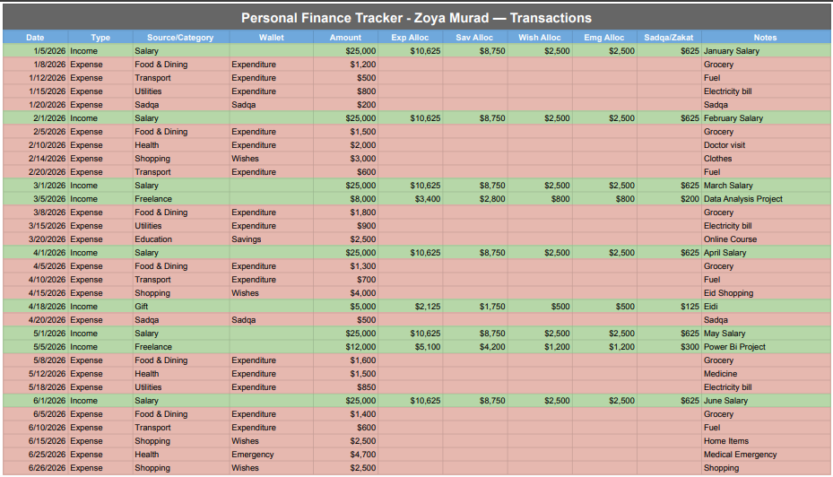

# 💰 Personal Finance Tracker

## 📌 Project Overview
A complete personal finance management system built entirely in Google Sheets — featuring automatic income allocation across 5 wallets, monthly budget tracking with color-coded alerts, and a live interactive dashboard. Designed and built from scratch, including a unique **Sadqa/Zakat wallet** for charitable giving tracking.

## 🛠️ Tools Used

## 📂 Project Structure
| Sheet | Purpose |
|-------|---------|
| `Settings` | Single source of truth — wallet split %, budget limits, savings goal, dropdown categories |
| `Transactions` | Main data entry — income/expense logging with automatic wallet allocation |
| `Wallets` | Real-time wallet balances, split %, and current month contributions |
| `Monthly Summary` | Month-by-month breakdown with color-coded budget status |
| `Dashboard` | Live visual overview — KPIs, charts, savings goal, wallet status |

## 💡 Key Features

### 🏦 5-Wallet Auto-Split System
Every income transaction automatically splits into 5 wallets based on configurable percentages:
- **Expenditure** (42.5%) — daily spending
- **Savings** (35%) — long-term goals
- **Wishes** (10%) — discretionary spending
- **Emergency** (10%) — safety net
- **Sadqa/Zakat** (2.5%) — charitable giving, highlighted in pink to encourage consistent giving 🤲

### 🚦 Smart Monthly Budget Alerts
Each wallet has a configurable monthly spending limit. Status updates automatically:
- 🟢 **Safe** — under 90% of limit
- 🟡 **Warning** — 90-100% of limit
- 🔴 **Over Budget** — exceeded limit
- ✅ **No Limit** — Sadqa wallet (charity shouldn't be capped)

### 📊 Live Interactive Dashboard
- 4 real-time KPI cards (Income, Expenses, Saved, Savings Rate)
- Wallet balance bar chart
- Expense category breakdown (pie chart)
- 12-month income vs expense trend line
- Savings goal progress bar
- Current month wallet status panel

### 🔒 Data Integrity
- Dropdown validation for Type, Category, Wallet — zero free-text errors
- Date and number validation
- Conditional formatting — green for income, red for expenses
- All formulas use `IFERROR` for clean fail-safe outputs

## 🧮 Technical Highlights
- `SUMPRODUCT` for multi-condition monthly calculations
- `INDIRECT` + `MATCH` for dynamic month-to-row lookups (auto-updates every month, no manual changes needed)
- Dynamic year handling via Settings sheet — works for any future year
- Cross-sheet formula architecture — Settings drives Transactions → Wallets → Monthly Summary → Dashboard

## 📸 Dashboard Preview

## 📈 Monthly Summary with Budget Alerts

## 👛 Wallets Overview

## ⚙️ Settings — Single Source of Truth

## 📋 Transactions Log

## 🎯 Key Insight
This system isn't just a tracker — it's a values-driven budgeting tool. By dedicating a fixed percentage to **Sadqa/Zakat** with every income entry, charitable giving becomes a built-in habit rather than an afterthought — a feature not found in most finance tracking templates.

## 👩‍💻 Author
**Zoya Murad** — Data Analyst & Aspiring Data Scientist
